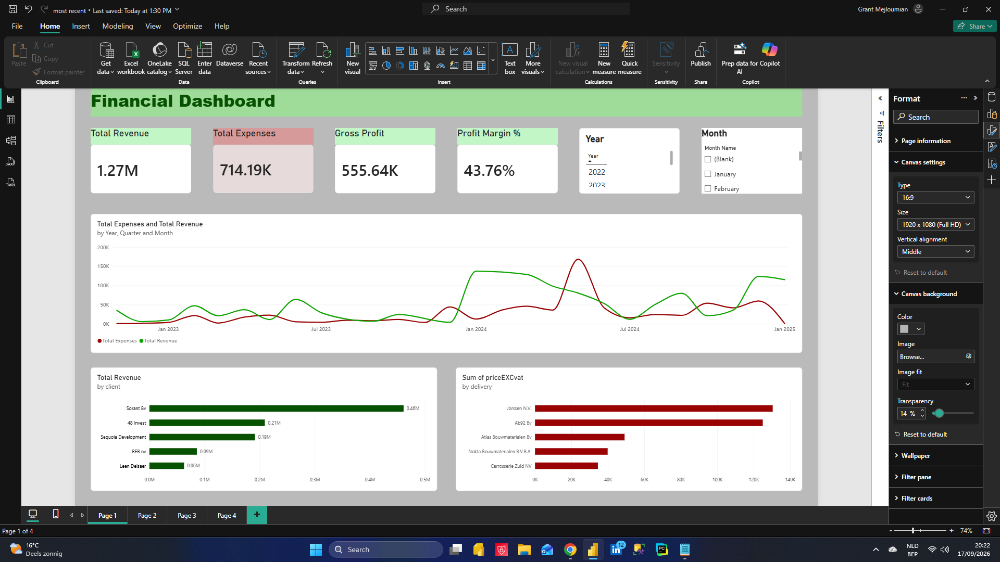
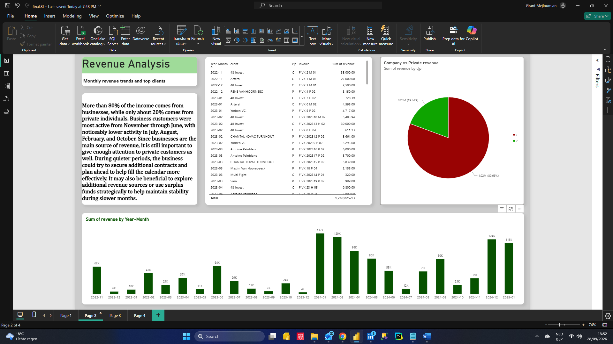
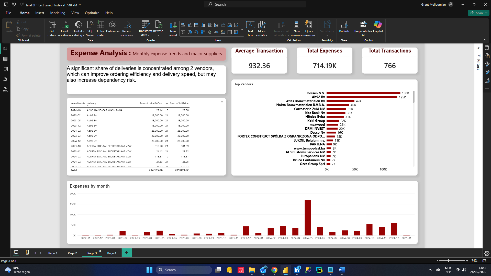
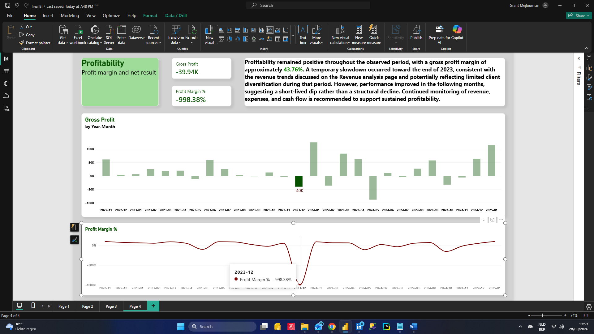

# Construction Company Antwerp — Financial Health Analysis (Power BI)

## Project Summary
This project analyzes the financial health of a construction company in Antwerp using Power BI dashboards and a written case study.

## Business Objective
Provide a high-level assessment of financial performance using available transaction data (revenue, expenses, net profit, and profit margin).

## Tools Used
- Python
- SQL
- Excel
- Power BI

## Dashboard Preview

### Screenshot 1

### Screenshot 2

### Screenshot 3

### Screenshot 4

## Full Report
[Download the PDF report](report.pdf)

## Notes
Interactive embedding is not included due to Power BI licensing limitations.  
This repository provides screenshots and full documentation.
